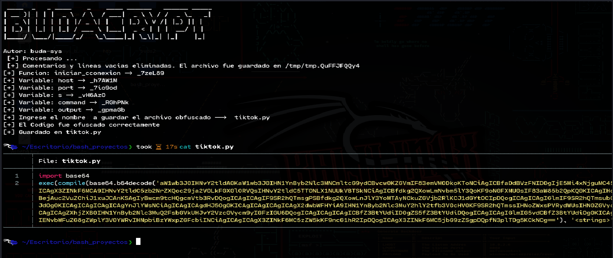

[](https://github.com/buda-sys/budacrypt/releases)
[](https://github.com/buda-sys/budacrypt/blob/main/LICENSE)
[](https://www.python.org/)
[](https://github.com/buda-sys/budacrypt/commits/main)


# 🛡️ BudaCrypt - Ofuscador de Archivos Python

##  Introducción

**BudaCrypt** es una herramienta básica de ofuscación de scripts `.py`, diseñada para entornos educativos, de laboratorio o testing, donde se busca evadir análisis de antivirus simples (como los de Windows 10 sin Defender avanzado).

Su propósito es **ocultar el código real**, dificultar el análisis manual o automatizado, y permitir su posterior conversión a `.exe` sin levantar alertas.

> ⚠️ **Uso ético únicamente.** Esta herramienta está pensada para pruebas en entornos controlados. No debe usarse con fines maliciosos.

---

##  Funcionalidades

**BudaCrypt** aplica múltiples técnicas básicas de evasión y ofuscación:

- 🔹 Eliminación de **comentarios** y **líneas vacías**.
- 🔹 Renombramiento de **funciones** y **variables** con nombres aleatorios.
- 🔹 Inserción de **código basura** y **comentarios falsos** para distraer análisis estático.
- 🔹 Codificación del script en **Base64**.
- 🔹 Ejecución del código ofuscado mediante `exec()` y `compile()`.

---

##  ¿Para qué sirve?

- Camuflar herramientas o malware en fase de prueba.
- Evadir antivirus básicos o gratuitos.
- Aumentar la resistencia frente a ingeniería inversa rápida.

---

##  Próximamente

- 🔐 Cifrado adicional XOR o AES.
- ⚙️ Generador `.exe` automático con `pyinstaller`.
- 📶 Selector de nivel de ofuscación.
- 🎭 Empaquetado con icono señuelo (`.ico`).

---

##  Archivos

| Archivo              | Descripción                                      |
|----------------------|--------------------------------------------------|
| `budacrypt.sh`       | Script principal de ofuscación.                  |
| `archivo.py`         | Archivo original de prueba (tu script).          |
| `crypt.py`           | Archivo final ofuscado, listo para compilar.     |

---

## 🧾 Comandos de Uso

| Comando                                         | Descripción                                                |
|------------------------------------------------|------------------------------------------------------------|
| `chmod +x budacrypt.sh`                        | Da permisos de ejecución al script Bash.                  |
| `./budacrypt.sh archivo.py`                    | Ejecuta el ofuscador sobre el archivo original.           |
| `cat crypt.py`                                 | Muestra el archivo ofuscado y codificado en base64.       |
| `python3 crypt.py`                             | Ejecuta el script ya ofuscado desde Linux.                |
| `pyinstaller --onefile --noconsole archivo.py` | Compila el `.py` a `.exe` sin mostrar consola.            |

---

## 💻 Modo de Uso

1. Clona el repositorio y da permisos de ejecución al script:

```bash
git clone https://github.com/buda-sys/budacrypt.git
cd budacrypt
chmod +x budacrypt.sh
```

2. Ejecuta la herramienta:

```bash
./budacrypt.sh prueba.py
```

 3. Sigue las instrucciones interactivas. El script te preguntará por el nombre que deseas para el archivo final ofuscado.
 
 
 ## Resultado
 
 

 
---

##  Fin del Script

BudaCrypt nació para ocultar lo que otros no deben ver.  
No se trata de destruir, sino de dominar el arte del camuflaje digital.  
El que controla el código, controla la guerra.

> 💻 Hecho por Buda-sys — Red Team Mentality.

---

##  Versión

- Versión: 1.0.0  
- Fecha: 27 de julio de 2025  

---

##  Huella digital

```bash
49145c62c9ace6cdfc36509d52f9dc930066df99b0cac318fb8f89017f56b9df  budacrypt.sh
```
